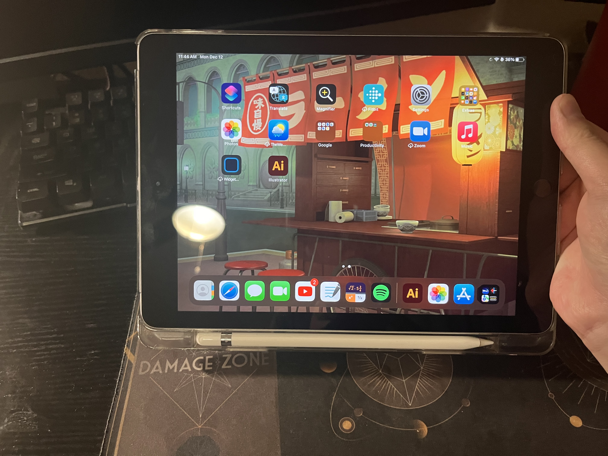
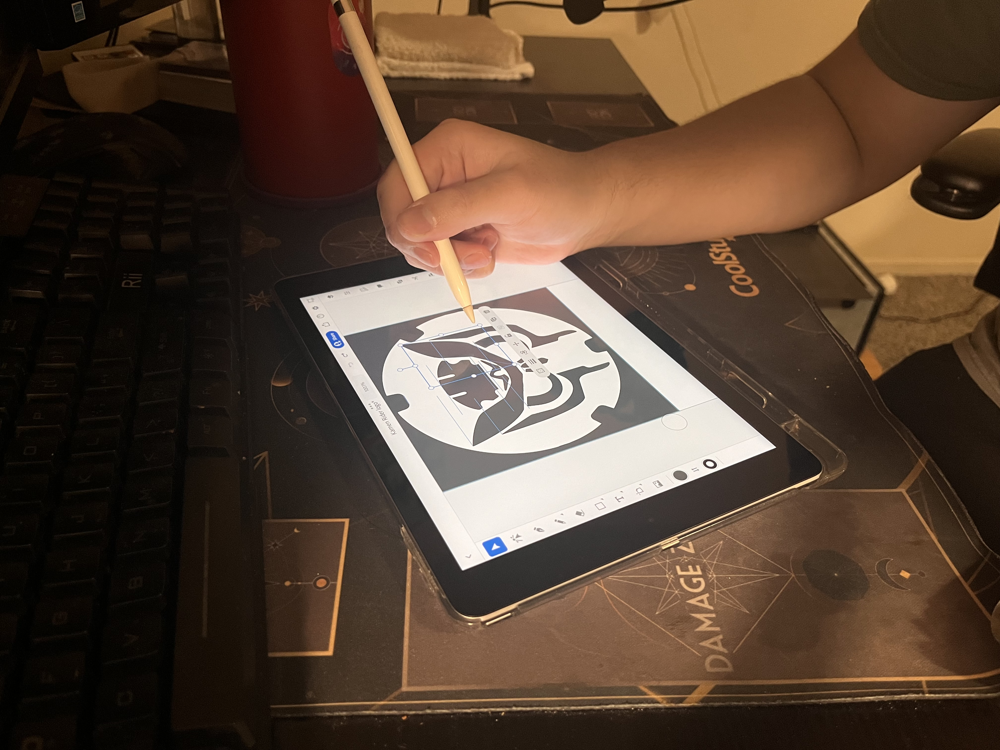

# Taking a artistic approach
### By Jeeno Thongsavat 12/14/22

Recently, I have been more and more interested in doing self-made projects for various hobbies I have. It helps to keep me busy and I feel a great sense of accomplishment when I finish one of these types of projects. They are also really fun and I learn a lot from trying new activities that are outside my expertise. Currently, I am dabbling in designing a logo that is based on a show that I am currently watching. I am by no means an artistic person. I have little to no experience in drawing anything, the best I can really muster is probably a crude stick figure. However, I was really inspired to go and make my own custom logo. Having remembered that being a student here at Chico State and earlier in the semester we signed up for Adobe software, I tried my hand at Adobe Illustrator. 

I downloaded the app on my Ipad, logged in with my CSU Chico account, and went at it being really motivated that I could easily make the illustration. Within the show each individual has a logo that represents them based on an animal. After hours of looking at the reference material, mulling over what animal to pick, and drawing a mock up design. I finally began to try my hand designing the real thing. When I first opened the application, the layout was exactly the same as Adobe XD. I instantly knew where I should navigate to start a new project. However, the real struggle is just up ahead. Opening up a new project for the first time I was greeted with a blank piece of paper and a lot of buttons on the side. None of the buttons were labeled. I had a hard time trying to figure out what buttons did what or how to even start drawing in the first place. I first just started to use my Apple Pencil to draw a line to see if that did anything. It turns out the default button, which is the first button on the left side, is the selector tool. Quickly after figuring this out, I decided to try another selection. I tried out the pencil icon and finally was able to make some progress with my design. This allowed me to draw out the outline for the design, but I was not making much progress. Realizing this I decided to use shapes that could help speed up the design process. I clicked on the square icon and looked at the drop down menu. I then select the circle icon and draw to see if I can make a circle. Easy enough I was able to make a circle and change the thickness of it. I then go to use the eraser tool and quickly realize a problem. When using the eraser tool, it will erase the line, however when erasing a shape is the confusing bit. It will erase the bit you want to erase, but the shape will snap back together. When I tried to erase half of the circle to make a crescent shape, the shape snapped back together to create a dome shaped object. Figuring this out I decided to mess around with the eraser and try out different methods around it. I try to erase an edge of a line and realize that it will smooth out anything it erases. After minutes of learning how to use the eraser, I finally try to make some progress toward designing the logo. Since I lack a lot of artistic skills, I realize that I am not making much progress after 30 minutes. I then had the bright idea of importing a logo from the show and trace out the shapes that I need to get the lines better. I quickly go to Google, download a logo, and import it quickly onto the document. The process was very simple and painless. After importing a logo, I get a pop up message telling me about something called “vectorization.” I had no idea what it was and the info provided did not give me a clear description on what it was. I left it alone for now. I then go out to trace the shapes to see if I could replicate at least some of them. I had no success in the matter. Drawing by hand and getting a good shape that I like was difficult. In this process, I figured out that you could edit points on the line to change the shape of it. I play around with that a bit and find it to be a bit tedious, but a useful tool nonetheless. After a bit of struggling, I then go back to try out this vectorization. Turns out, it traces out the shapes of the image and makes them for you. I was completely amazed and figured out I was struggling for nothing. Having seen this, I quickly mess around with all of the new shapes that were made to edit my logo into what I want it to be. 

The process of creating the logo at this point was so much easier and I made a significant jump in progress compared to how I was an hour ago. I could just copy and paste the shapes and edit them how I see fit. Using the tool where I could edit the points around the shape I was able to make shapes that I couldn’t even dream of trying to draw by hand at that point. I start to feel a lot more confident that I could actually finish this a lot quicker than I thought. After working on it for a couple more minutes and debating back and forth if there should be anything else I add. I finally came up with a design that I am happy with. I am pretty proud of myself for coming up with a design and learning how to use this application. 

The process of trying to use Adobe Illustrator for the first time was honestly pretty frustrating and tedious. I am quite sure I am not within the target market for using applications such as this, since I have no artistic background whatsoever. Luckily, the application was pretty **Error Tolerant**, having an undo button greatly helped me out when trying to draw. Trying to navigate the buttons and figure out what they do was pretty much trial and error. I was guessing what buttons did what and learning as I went. After struggling for hours with much frustration, I was met with a satisfying ending. 
